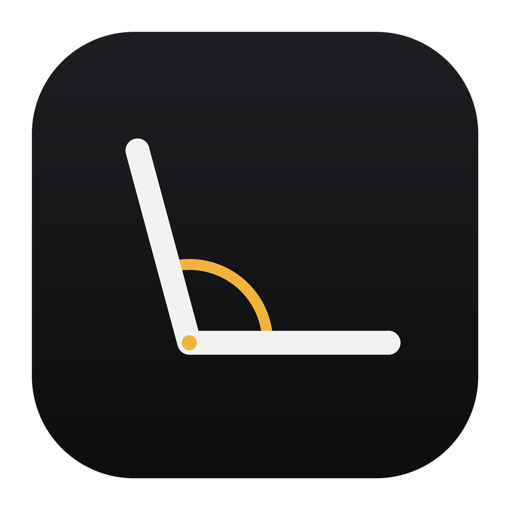

# Hinge

[English](README.md) · 日本語



MacBook の蓋を少し閉じても、デスクトップはその場に残る。パネルは手前に
倒れてくるが、そこに描かれる内容は描き直され、調整したときの角度のまま
部屋に立っているように見える。

## しくみ

蓋の角度は Apple silicon の MacBook が内蔵する HID センサー
(usage page `0x20`、usage `0x8A`) から 60 Hz で読む。デスクトップは
ScreenCaptureKit で受け取り、Hinge 自身のウィンドウは除外する。
各フレームは、ヒンジ・パネルの角度・視点の位置という三つから組み立てた
射影変換を通して描かれる。

ヒンジは下辺なので、その辺だけは動かず、常に画面の幅いっぱいを保つ。
その上のすべては、「立ったままの仮想ディスプレイを見るには視線が
どこを通るか」で置き直す。パネルの上部は視点に近づいているので、
同じ実寸の幅がより少ない座標しか占めず、上へ行くほど狭く描かれる。
仮想ディスプレイの上端はパネルの外に出るため、その分は切り落とされる。
部屋の中で実際に起きることと同じ。

角度の調整では、視線がパネルの法線と一致し、画面の中央を通ると仮定する。
この仮定を置くと、調整した角度そのものは変換の形から消え、
残る自由度は視点までの距離だけになる。

その距離は勘ではなく導出する。蓋を少し閉じた領域では仮想ディスプレイが
パネルの上端まで届かず、足りない分を縦の引き伸ばしで埋めることになる。
その引き伸ばしをどの角度でも 1% 未満に抑える条件が、距離の下限を決める。

```
D ≥ h(½+ε)·sinΔ / (1+ε−cosΔ)
```

最悪値は Δ = √(2ε) ≈ 8 度にあり、画面高さの 3.6 倍が得られる。
15 インチの MacBook なら約 72 cm で、実際に人が座っている距離とほぼ一致する。

ぼかしは上端から始まり、蓋を閉じるにつれて下へ降りてくる。同じフレームを
鮮明な複製とぼかした複製の二枚重ねにし、ぼかした側のグラデーション
マスクで境界を動かしている。

## ビルド

```
./make_app.sh
```

Swift Package Manager でビルドしたバイナリを .app に包み、アドホック署名する。
Xcode プロジェクトは使わない。

## 実行

```
open Hinge.app
```

画面収録の権限が要る。初回起動時に、システム設定のプライバシーとセキュリティの
どこで許可するかを案内するので、許可してから開き直す。

アドホック署名はビルドのたびにハッシュが変わり、許可済みの記録が無効になる
(設定上は有効なまま見える)。`make_app.sh` は古い記録を消してから終わるので、
再ビルドのたびに一度許可し直す。

Hinge は常駐する。設定ウィンドウは Dock アイコンかメニューバーの項目から開き、
閉じてもアプリは動き続ける。終了は設定内のボタンか ⌘Q。二つ目は起動せず、
すでに動いているほうに引き渡す。

オーバーレイは傾きが付いたときだけ出るので、普段の角度ではメニューバーも
Dock もそのまま使える。

## 設定

- **Flat above** — この角度以上でデスクトップが画面いっぱいになる。
  ボタン一つで、いまの蓋の角度をそのまま基準にできる。
- **Shortcut** — どのアプリからでも同じことをするシステム全体のキー。
  いつも座っている姿勢のまま基準を取れる。既定は ⌃⌥⌘H で、表示されている
  組み合わせをクリックして別のキーを押せば変わる。決まった角度はメニューバーに
  少しのあいだ出る。Control・Option・Command のいずれかが要る。
  修飾なしのキーはどこでも飲み込まれてしまうため。
- **Perspective** — 100% が導出した視点距離。下げると距離が離れ、補正が弱まる。
  近づく方向には動かない。
- **Max blur** と **Shadow** — 傾きが最大のときにどこまで効かせるか。
- **Open Hinge at login**。
- **Install updates automatically** — 既定はオフ。オンにすると、新しい
  リリースを見つけ次第ダウンロードして入れ替え、そのまま起動し直す。
  オフのときは、どのバージョンが来ているかをボタンが示し、押したときだけ入れ替える。

## 更新

Hinge は起動時と六時間ごとに、GitHub の
[Pikare02/Hinge](https://github.com/Pikare02/Hinge) の最新リリースを見にいく。
タグから `v` を除いたものが、いま入っているバージョンより上なら更新とみなす。
リリースには `Hinge.app` の zip が添付されている必要がある。その zip を `ditto`
で展開し、中に実行ファイルがあることを確かめてから、動いているほうと入れ替える。
途中で失敗した場合は、入っているものには手を付けない。

Developer ID ではなくアドホック署名であることから、二つのことが出てくる。
署名のハッシュはビルドのたびに変わるので、更新すると画面収録の許可が無効になり、
新しいほうがまた許可を求める。つまり自動更新にしていても、その許可待ちで
止まったままになる。もう一つは、更新を裏付けるものが GitHub への HTTPS と、
そのリポジトリに publish できる人だけだということ。きちんと署名すれば
どちらも解決する。


## 画面を覆わずに確かめる

```
.build/release/Hinge --selfcheck   # 変換を角度ごとに検証
.build/release/Hinge --probe       # 実機の蓋の角度と権限の状態
.build/release/Hinge --hotkey      # いまのショートカットと、登録できたかどうか
```

`--selfcheck` は、うっかり壊しやすい前提を assert で押さえている。
どの角度でも下辺が正確に画面幅のままであること、上へ行くほど狭くなること、
黒帯が出ないこと、引き伸ばしが 1% 付近に収まること。

## 必要なもの

- lid angle sensor を持つ Apple silicon の MacBook
- macOS 14 以降

設計メモは [docs/spec.md](docs/spec.md) にある (英語)。
